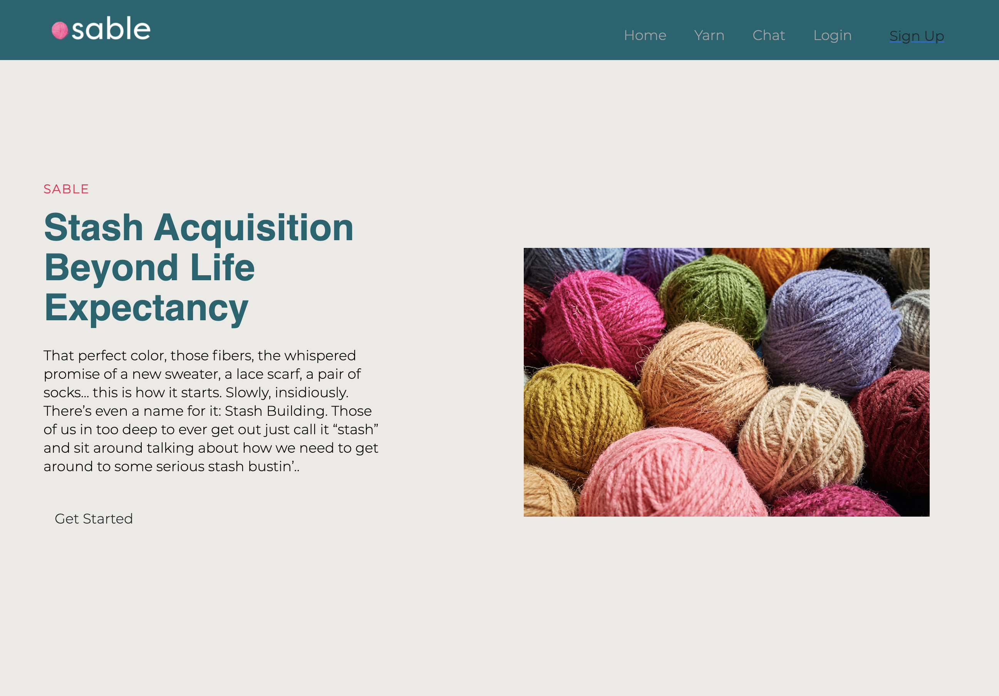
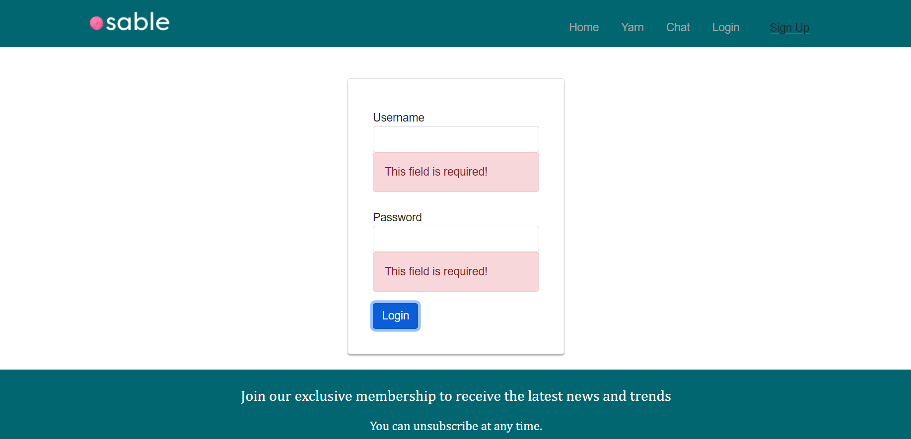

# SABLE

## Table of Contents

- [Description](#description)
- [Installation](#installation)
- [Packages](#packages)
- [Technology](#Technology-Use)
- [Usage](#usage)
- [At A Glance](#At-A-Glance)
- [License](#license)
- [Links](#links)
- [Contributors](#contributors)
- [Questions](#questions)

## Description

SABLE - Stash Acquisition Beyond Life Expectancy
It is an web application for crochet and knitting enthusiast.

## Packages

- backend

* nodemon
* concurrently
* axios
* bcrypt
* dotenv
* mongodb
* mongoose
* express
* express-session
* connect-mongodb-session

- frontend

* React
* React-scripts
* react-dom
* react-hook-form
* react-validation
* bootstrap

\*\* if you want to learn more about these packages please visit https://www.npmjs.com/ for npm packages and https://reactjs.org/ for React

## Technology-Use

Emailjs
redis
socket.io-client

## Installation

To install the required dependencies, run the following command:
npm install

## Usage

The user will be prompted to sign up and log in.
The user can then enter yarn information.
The user can also chat with other user.
The user can also subscribe to newsletter if they enter their name and email on the subscribe button.

## At-A-Glance

## License

The project is licensed under the MIT license.

### Links

https://damp-hollows-69227.herokuapp.com/

## Contributors

Callie Nipper -- https://github.com/calliebn

Goldiluck Rebollido -- https://github.com/goldreb

KP -- https://github.com/10-kp

Josseline Rendon --https://github.com/JGrandbit

## Questions?

Please email
-- callie.nipper@gmail.com
-- gorebollido@gmail.com
with any questions.
